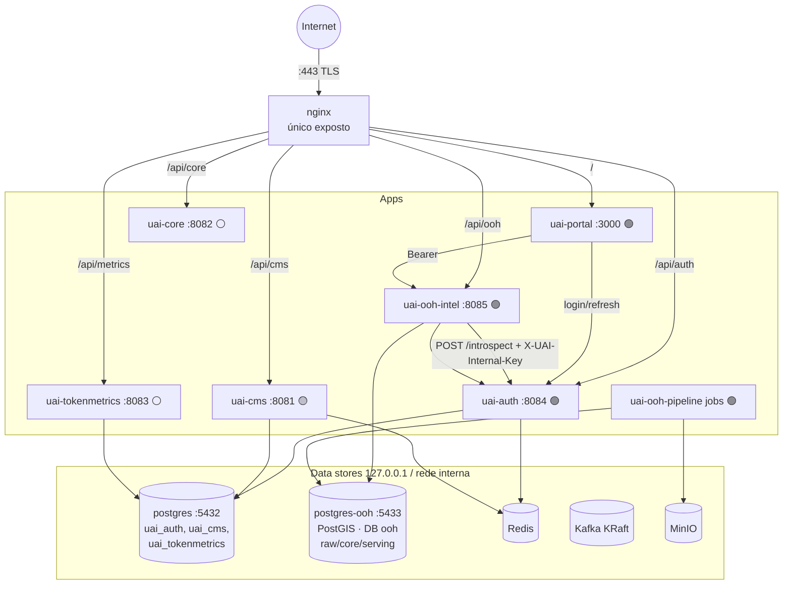
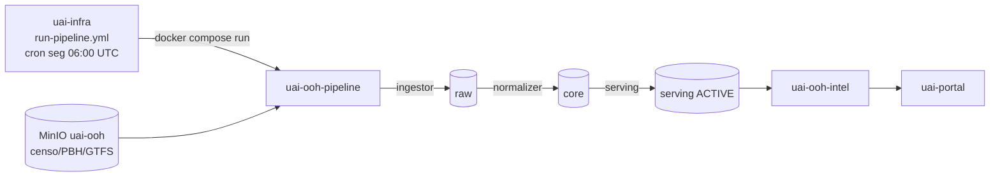
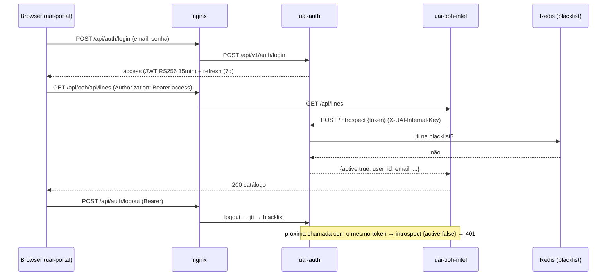

# Arquitetura da plataforma uAI

> **O que é este documento.** Visão única e *platform-wide* de como o sistema uAI Comunicação
> funciona: os microsserviços, o banco de dados, a pipeline de dados, a autenticação, o deploy e as
> decisões que amarram tudo. O objetivo é onboarding — ler isto e entender a plataforma inteira sem
> caçar arquivo por arquivo.
>
> **Fonte:** construído a partir do **código do momento** (exploração read-only de cada repo
> `uai-*`, jun/2026). Onde a intenção (arquitetura-alvo) ainda não está no código, o texto **marca o
> estado real**: 🟢 implementado/live · 🟡 scaffold (esqueleto, lógica pendente) · ⚪ desativado no
> deploy atual · 🗄️ legado congelado.
>
> **Deep-dive do vertical OOH:** ver [`arquitetura-servicos.md`](arquitetura-servicos.md) (decomposição
> OOH F1→F3) e [`plano-normalizacao-core.md`](plano-normalizacao-core.md) (modelo do schema `core`).
> **Auth:** ver [`prd/2026-06-06-uai-auth-mvp-ooh-cutover-design.md`](prd/2026-06-06-uai-auth-mvp-ooh-cutover-design.md).

---

## 1. Visão geral & princípios

**uAI Comunicação** é uma plataforma **multi-vertical** (agência de marketing 100% IA + vertical OOH
de inteligência de mídia em ônibus de BH, e o que vier) que roda num **VPS único** com Docker Compose.
Tudo é orquestrado por um repositório de infra central; os repos de aplicação só publicam imagens.

### Princípios-âncora

- **VPS único + Docker Compose.** Uma stack só (`uai-infra/docker-compose.yml`), rede bridge
  `uai-net`. **Só o Nginx (`:80`/`:443`) é exposto à internet**; todo o resto fica em `127.0.0.1`
  (Postgres, MinIO, Kafka-UI) ou só na rede Docker (Redis, Kafka, apps).
- **Deploy 100% centralizado no `uai-infra`.** Repos de app **nunca tocam a VPS** — só publicam
  imagem `:latest`/`:<sha>` no GHCR (`ghcr.io/mddinizbh/...`). O `uai-infra` faz o SSH e o
  `docker compose up`. (Regra reforçada no CLAUDE.md: "Nunca editar VPS direto.")
- **Auth delegada ao `uai-auth` por introspection.** Nenhum serviço de recurso valida JWT
  localmente: pergunta ao `uai-auth` (`POST /introspect`). Centraliza política de revogação.
- **`X-UAI-Internal-Key` (ADR-040)** para chamadas service-to-service (`/internal/**`, `/introspect`,
  `/revoke`). Comparação timing-safe; chave em branco ⇒ 401 (fail-safe).
- **Hexagonal single-module** por serviço Java (ports & adapters); **sealed sem `default`** para
  tipos finitos (RULE-JAVA-02); `tenant_id` (+RLS quando houver) **só onde há dado de tenant**.
- **Sem segredo no Git nem na imagem** (RULE-OPS-01): toda config vem de env; o `.env` real só
  existe em `/opt/uai/.env` na VPS, gerado dos GitHub Secrets.

### Os três planos (+ frontend)

| Plano | Tem tenant? | Serviços | O que é |
|---|---|---|---|
| **Platform** | parcial | `uai-core`, `uai-auth`, `uai-tokenmetrics` | Capacidades transversais (IA, identidade, custo) |
| **Comercial** | **sim** (`tenant_id`) | `uai-cms` | Clientes, campanhas, cobrança, aprovação de conteúdo |
| **Dados / referência** | **não** (ADR-004) | `uai-ooh-pipeline`, `uai-ooh-intel` | Dados públicos de OOH (sem dono/tenant) |
| **Frontend** | n/a | `uai-portal` | SPA que consome os planos acima |

> O `uai-cms` é o ponto de encontro: gestor **multi-vertical** que cresce generalizando o lifecycle
> comum (cliente/campanha/cobrança) e **delegando** os specifics por `campaign.type` (`marketing` |
> `ooh`). Ele orquestra os backends de cada vertical; não embute lógica de vertical.

---

## 2. Mapa de serviços

| Serviço | Plano | Papel | Stack | Porta | Tenant | Estado |
|---|---|---|---|---|---|---|
| **uai-portal** | frontend | SPA (landing + login + módulo OOH) | React 18 + Vite + TS | 3000 | não | 🟢 live |
| **uai-auth** | platform | Identidade: emite/valida JWT, introspection, revogação | Java 21 · Spring Boot 3.3.6 | 8084 | parcial (`tenant_id`) | 🟢 live (cutover) |
| **uai-ooh-intel** | dados | API read-only de serving OOH (catálogo/ficha/ranking) | Java 21 · Spring Boot 3.3.6 | 8085 | não (ADR-004) | 🟢 live |
| **uai-ooh-pipeline** | dados | Ingestor + normalizer (`raw`→`core`→`serving`) | Python ≥3.12 + PostGIS | jobs | não | 🟢 live (F1) |
| **uai-cms** | comercial | Gestor multi-vertical + BFF/edge do portal | Java 21 · Spring Boot 3.3.6 | 8081 | **sim** (`tenant_id`, sem RLS) | 🟡 só schema |
| **uai-tokenmetrics** | platform | Metering de custo de tokens LLM | Java 21 · Spring Boot 3.3.5 | 8083 | sim (header `X-Tenant-Id`) | 🟢 impl · ⚪ off |
| **uai-core** | platform | Motor de IA (11 agentes de marketing) | Java 21 · Spring Boot 3.3.5 · LangChain4j | 8082 | (a definir) | 🟡 scaffold · ⚪ off |
| **uai-ooh-service-template** | — | Template hexagonal dos serviços Java OOH | Java 21 · Spring Boot 3.3.6 | 8080 | não | 🟢 template |
| **uai-infra** | infra | Deploy centralizado (compose, Nginx, secrets, jobs) | Docker Compose + GitHub Actions | — | — | 🟢 |
| ~~uai-bus-lines-map~~ | dados | API+SPA pública de linhas (`linhas.uaiagencia.com.br`) | Java + React/MapLibre | 8085 | não | 🗄️ legado · ⚪ off |

**Legenda:** 🟢 implementado/live · 🟡 scaffold (esqueleto; lógica pendente) · ⚪ desativado no deploy
atual (economia de RAM/disco na VPS) · 🗄️ legado congelado (tag `legacy-frozen`). `uai-spark`
(landing antiga) foi substituído pelo `uai-portal` no cutover F1 e está **fora do escopo deste doc**.

---

## 3. Topologia

Só o Nginx é público. Ele roteia por host + path para os containers internos, fazendo *rewrite* de
prefixo. Bancos e brokers ficam em `127.0.0.1`/rede interna.

```
                          Internet
                             │  :443 (TLS Let's Encrypt)
                    ┌────────▼────────┐
                    │      nginx       │  (único exposto)
                    └───┬───┬───┬───┬──┘
   uaiagencia.com.br:   │   │   │   │
     /            ──────┘   │   │   └────── /api/ooh/   → uai-ooh-intel:8085  🟢
     /api/auth/   ─► uai-auth:8084 🟢      │            (rewrite → /)
                              │            ├────── /api/cms/     → uai-cms:8081     🟡
     (/api/auth → /api/v1/auth)            ├────── /api/core/    → uai-core:8082    ⚪
                                           └────── /api/metrics/ → uai-tokenmetrics:8083 ⚪
   n8n.uaiagencia.com.br   → n8n:5678 ⚪
   linhas.uaiagencia.com.br→ uai-buslines(+web) 🗄️⚪

   uai-portal:3000 (SPA) ──Bearer──► uai-ooh-intel:8085 ──introspect──► uai-auth:8084
                                              │                              │
                          ┌───────────────────┴──────────┐         ┌────────┴────────┐
                          ▼                               ▼         ▼                 ▼
                   postgres-ooh:5433                    Redis    postgres:5432      Redis
                   (PostGIS, DB ooh:                  (cache)    (uai_auth,        (blacklist
                    raw/core/serving)                            uai_cms,           de jti)
                                                                 uai_tokenmetrics,
                   uai-ooh-pipeline (jobs) ──escreve──►          uai_buslines)
                   MinIO (uai-ooh, uai-media) · Kafka (KRaft) · kafka-ui
```



---

## 4. Os microsserviços, um a um

### 4.1 uai-portal — SPA (frontend) 🟢

- **Stack:** React 18 + TypeScript estrito + Vite 5, shadcn/ui (Radix) + Tailwind, `@tanstack/
  react-query`, `react-router-dom`, **MapLibre** (mapas OOH). Bootstrap original via Lovable.
- **O que entrega:** landing pública, login e o vertical **OOH** (`/ooh`): planejamento com filtros,
  ranking, ficha de linha, cesta, agregação e geração de proposta (PDF client-side).
- **Arquitetura interna:** shell (`src/components/portal`, `src/contexts`), libs transversais
  (`src/lib/auth`, `src/lib/api`) e o vertical em `src/modules/ooh` com estilo **ports & adapters**
  (`ProposalPort` com adapter local F1 trocável por `cms→agent` no Bloco 3). A sessão (`uai_session`)
  vive no `tokenStore` **fora do React** — fonte única lida pelo interceptor de fetch.
- **Com quem fala:** **direto com o `uai-ooh-intel`** (`/api/ooh`, dado read-only) e com o
  `uai-auth` (`/api/auth`), same-origin via Nginx. **Não usa o `uai-cms` hoje** — `VITE_API_BASE_URL`
  existe mas não é consumido (ADR-036 revisado: dado de referência read-only vem direto do intel; só
  o comercial passará pelo cms no Bloco 3).
- **Auth:** `VITE_AUTH_MODE=sso` seleciona o `realProvider` (login → tokens, `me` → perfil, refresh,
  logout); **refresh-on-401 transparente** com fila única; `stub` cunha JWT fake em dev. Branch atual
  `feat/auth-real-provider`.
- **Deploy:** Docker multi-stage (node:20 build → nginx:alpine na porta 3000). Imagem
  `ghcr.io/mddinizbh/uai-portal`. Serve a raiz `uaiagencia.com.br` (cutover spark→portal no F1).

### 4.2 uai-auth — identidade 🟢 (em cutover)

- **Stack:** Java 21 · Spring Boot 3.3.6, **hexagonal** (`com.uai.auth`), Postgres + Redis,
  `jjwt 0.12.6` (RS256), Flyway, BCrypt(12), Testcontainers + gate JaCoCo 80%.
- **O que faz:** **emite e valida** tokens. Access **JWT RS256, TTL 15min** (claims
  `sub`/`tenant_id`/`role`/`email`/`jti`) + **refresh opaco** (32 bytes, TTL 7d, **rotacionado** a
  cada refresh, guardado como SHA-256). Logout/revoke jogam o `jti` numa **blacklist Redis**
  (`blacklist:jti:<jti>`, TTL = vida restante) ⇒ revogação imediata.
- **Endpoints:** públicos `POST /api/v1/auth/{login,refresh}`, `GET /.well-known/jwks`; Bearer
  `POST /logout` + `GET /me`; **internos** (`X-UAI-Internal-Key`) `POST /introspect` (RFC 7662:
  retorna `{active,user_id,email,tenant_id,role,expires_at}`) e `POST /revoke`.
- **Banco `uai_auth`:** `tenant`, `user_account` (`tenant_id` NOT NULL, hash bcrypt), `refresh_token`.
  Flyway no startup (ADR-047). **`AdminSeeder`** (`ApplicationRunner`) re-aplica os hashes dos admins
  a partir do env **a cada boot** (UPSERT idempotente) — substitui a armadilha "once-only" das
  migrations; hash em branco ⇒ skip (fail-safe), nunca logado. Branch atual `feat/boot-admin-seeder`.
- **Segredos:** keypair RSA (PEM em **base64 single-line** via env), `UAI_INTERNAL_API_KEY`,
  hashes de seed — tudo do `uai-infra`. Keypair ausente ⇒ efêmero no boot (só DEV/TEST, emite WARN).

### 4.3 uai-ooh-intel — API de serving OOH 🟢

- **Stack:** Java 21 · Spring Boot 3.3.6, **hexagonal** (`com.uai.ooh.intel`), gerado do
  `uai-ooh-service-template`. **JdbcTemplate** puro (sem JPA entities, `ddl-auto=none`, Hikari
  read-only).
- **O que faz:** API **read-only** sobre o schema **flat `serving`** do banco `ooh`. Não possui o
  schema (quem materializa é o normalizer) — só lê, via role `ooh_intel_ro`, **escopado ao
  `dataset_version` ACTIVE** (`ActiveVersionResolver`, cache TTL curto).
- **Endpoints `/api/`:** `GET /lines` (catálogo pontuado), `/lines/ranking` (re-rank in-memory por
  pesos/público-alvo AB|DE), `POST /lines/aggregate` (cesta), `/lines/{id}`, `/lines/{id}/metrics`,
  `/lines/{id}/geo` (GeoJSON), `/regions` (cascata regional→bairro), `/actuator/health` (compósito:
  db + datasetVersion + ping).
- **Sem PostGIS em runtime (ADR-003):** geometrias já vêm pré-computadas como `geom_geojson` (jsonb
  GeoJSON 4326) e são repassadas como texto. **Single-tenant (ADR-004):** sem `tenant_id`/RLS.
- **Auth:** prod = **introspection** no `uai-auth` (`X-UAI-Internal-Key`, fail-closed, cache PT60S);
  dev/test = `stub`. `InternalApiKeyFilter` protege `/internal/**` (reservado p/ `cms→intel` no
  Bloco 3 — ainda sem endpoints concretos). Cutover stub→introspection feito em 2026-06-06.

### 4.4 uai-ooh-pipeline — ingestor + normalizer 🟢

- **Stack:** Python ≥3.12, CLI roda-e-sai (`python -m ooh_pipeline <stage> <job>`), `psycopg3`,
  `geopandas`, `boto3`, GTFS-RT bindings. **Sem framework web.** PostGIS (postgis/postgis:16-3.4).
- **Dois estágios num pacote só** (`ooh_pipeline/`, compartilham `db.py`/DSN):
  - **ingestor/** — 1 loader por fonte (GTFS estático/RT, censo IBGE 2022, PBH/CKAN, OSM/Overpass,
    POI Overture+FSQ) → schema **`raw`** (tudo TEXT, sem PK/FK).
  - **normalizer/** — `raw`→**`core`** (PostGIS, EPSG:31983) → materializa **`serving`** flat.
    Subpacotes por contexto: Identidades, Contexto, Métricas & Score, Serving.
- **Padrões:** trabalho pesado (KNN, `ST_*`, agregações) roda **server-side no Postgres** — Python só
  orquestra (~41 MB RSS). `ChunkedBuild` faz commit incremental e **resume por chave**
  (`core.build_progress`); `--rebuild` força do zero. Versionamento por `dataset_version`.
- **Contrato com o intel = o banco `serving`** (não há HTTP nem Kafka entre eles).
- **Deploy:** imagem roda-e-sai `ghcr.io/mddinizbh/uai-ooh-pipeline`; **execução centralizada no
  `uai-infra`** (`run-pipeline.yml`, cron seg 06:00 UTC + `workflow_dispatch`).

### 4.5 uai-cms — gestor multi-vertical + BFF 🟡

- **Stack:** Java 21 · Spring Boot 3.3.6, Postgres + Redis + Kafka + S3/MinIO + `jjwt`. Pacote
  `ai.uai.cms`.
- **Papel-alvo:** coração de negócio (tenants, clientes, briefings, campanhas `marketing|ooh`,
  conteúdo, **pipeline de aprovação** `GENERATING→PENDING_APPROVAL→APPROVED→PUBLISHED`, Media Asset
  Library) e **única porta com JWT externo** (BFF), agregando chamadas a core/tokenmetrics/auth.
- **Estado real:** **scaffold**. O ativo maduro é o **schema Flyway completo** (15 tabelas
  multi-tenant por `tenant_id` com FK + cascata, **sem RLS**; convenções em `docs/migrations.md`,
  ADR-002..005). A lógica (controllers, entidades JPA, Kafka, clients HTTP, JWT) **ainda não foi
  escrita** — `CorsConfig` hoje libera tudo (`permitAll`) com TODO para habilitar JWT.
- **Banco `uai_cms`** (no Postgres principal). Religação ao `uai-auth` por introspection: EPIC-003.

### 4.6 uai-tokenmetrics — metering de custo 🟢 (⚪ off)

- **Stack:** Java 21 · Spring Boot 3.3.5, Spring Data JPA + Flyway. Pacote `ai.uai.tokenmetrics`
  (layered; alvo hexagonal num épico futuro).
- **O que faz:** `POST /api/usage` registra cada chamada LLM (modelo, tokens in/out, agente,
  campanha), busca preço em `model_pricing`, calcula **custo USD→BRL** (taxa configurável) e
  persiste em `token_usage`. Uma **trigger** faz UPSERT em `usage_aggregate` por
  `tenant_id+campaign_id+agent_id+mês`. Leituras agregadas: `/summary`, `/by-agent`,
  `/by-campaign/{id}`, `/cost`; catálogo gerenciável por `GET/PUT /api/pricing/models`.
- **Tenant:** header **`X-Tenant-Id`** (UUID) validado por interceptor; `tenant_id` NOT NULL nas
  tabelas (sem RLS; `model_pricing` é catálogo global). Banco `uai_tokenmetrics`.
- **Auth:** **nenhuma** hoje (é um sink; alvo = destino do AOP `@TrackTokens` do `uai-core`).

### 4.7 uai-core — motor de IA 🟡 (⚪ off)

- **Stack:** Java 21 · Spring Boot 3.3.5 (MVC + WebFlux + AOP), **LangChain4j 1.0.0-beta2**. Pacote
  `ai.uai.core`.
- **Papel-alvo:** hospedar **11 agentes de marketing** (Discovery, Orchestrator, Meta/Google Ads,
  SEO Local, Instagram, Pricing, Copy, Image, Video, Report) via **pipelines declarativos**
  (`resources/pipelines/<agent>/`: `pipeline.yml` + steps `.md`). **Stateless** — sem banco
  relacional, **Redis só para ChatMemory** (única função do LangChain4j). LLMs: Anthropic
  `claude-sonnet-4-6`, OpenAI `gpt-4o`, Google `gemini-2.5-pro`.
- **Estado real:** **scaffold** — só `HealthController`/`CorsConfig`. Clientes para cms/tokenmetrics/
  n8n, Kafka (autoconfig **desabilitada**), `@TrackTokens` e o `/internal/**` com `X-UAI-Internal-Key`
  **ainda não implementados** — só URLs em `application.yml`.

### 4.8 uai-ooh-service-template — molde hexagonal 🟢

- Template GitHub **domain-free** (`com.uai.ooh.template`): camadas `domain`/`application`/`adapter`,
  exemplo `GET /api/ping`, `InternalApiKeyFilter` (`/internal/**` + `X-UAI-Internal-Key`, fail-safe),
  OpenAPI/Swagger, JaCoCo 80%, Testcontainers pinado. Base de todos os serviços Java do vertical OOH
  (o `uai-ooh-intel` nasceu dele). Decisões: RULE-JAVA-01 (pacote base), RULE-JAVA-02 (sealed sem
  `default`), RULE-OPS-01 (sem segredo na imagem), `ddl-auto=validate` (schema é de migrations).

---

## 5. Como o banco funciona

A plataforma usa **dois servidores PostgreSQL** e o princípio **um DB por serviço, sem cross-DB join**
(ADR-052) — integração entre serviços é por HTTP/`X-UAI-Internal-Key` ou (no futuro) Kafka, nunca por
join entre bancos.

| Servidor (container) | Host | Imagem | Bancos / schemas |
|---|---|---|---|
| `postgres` | `127.0.0.1:5432` | postgres:16-alpine | `uai_auth`, `uai_cms`, `uai_tokenmetrics`, `uai_buslines` (legado); schema `n8n` dentro de `uai_cms` |
| `postgres-ooh` | `127.0.0.1:5433` (interno `:5432`) | **postgis/postgis:16-3.4** | `ooh` — schemas `raw`, `core`, `serving` |

> Serviços na rede Docker conectam pelo **nome do serviço** (`postgres-ooh:5432`); o `5433` é só o
> mapeamento de host para acesso externo/MCP.

### Persistência e tenant por serviço

| Banco | Dono | Migrations | Multi-tenant |
|---|---|---|---|
| `uai_auth` | uai-auth | **Flyway** no startup (ADR-047) | `tenant_id` no JWT e nas tabelas |
| `uai_cms` | uai-cms | **Flyway** (V1-V4 + `R__seed_dev`) | `tenant_id` (FK + cascata), **sem RLS** |
| `uai_tokenmetrics` | uai-tokenmetrics | **Flyway** (V1-V3) | header `X-Tenant-Id`; `tenant_id` NOT NULL |
| `ooh` | **uai-ooh-pipeline** | **código da pipeline** (raw SQL, sem ORM/Flyway) | **não** — single-tenant (ADR-004), versionado por `dataset_version` |

### O banco `ooh` em três camadas (raw → core → serving)

É o coração de dados do vertical OOH. A pipeline transforma fonte bruta em produto pronto pra
consumir, em três estágios versionados:

```
 Fontes brutas                raw (landing)           core (normalizado)          serving (flat)
 ─────────────                ─────────────           ──────────────────          ──────────────
 GTFS estático/RT  ─┐         tudo TEXT, sem          PostGIS, EPSG:31983          tabelas planas,
 censo IBGE 2022    │ ingestor PK/FK, fiel à   normalizer  identidades+contexto  serving  geom = jsonb
 PBH / CKAN         ├────────►  fonte      ────────►  +métricas+score    ──────►  GeoJSON 4326
 OSM / Overpass     │         (raw.gtfs__*,          (core.line, stop,           (sem PostGIS no
 POI Overture+FSQ  ─┘          raw.censo__*, …)       trip_pattern, line_         consumidor — ADR-003)
                                                      metrics, …)
                              dataset_version:        core.dataset_version        serving.dataset_version
                                                      BUILDING/ACTIVE/ARCHIVED    IMPORTING→ACTIVE (swap atômico)
                                                                                          │
                                                                            uai-ooh-intel lê só a versão
                                                                            ACTIVE via role ooh_intel_ro
```

```mermaid
flowchart LR
  subgraph ooh[(DB ooh · PostGIS)]
    raw[schema raw<br/>TEXT, landing fiel]
    core[schema core<br/>normalizado · EPSG:31983<br/>dataset_version BUILDING/ACTIVE]
    serving[schema serving<br/>flat · geom jsonb GeoJSON 4326<br/>swap IMPORTING→ACTIVE]
  end
  src[GTFS · censo · PBH · OSM · POI] -->|ingestor| raw
  raw -->|normalizer| core
  core -->|normalizer/serving| serving
  serving -->|JdbcTemplate read-only<br/>role ooh_intel_ro| intel[uai-ooh-intel]
```

- **`raw`** — landing zone: tudo TEXT, sem índice por design; a normalização cria os índices que
  precisa ao rodar.
- **`core`** — identidades canônicas do transporte de BH (`line`, `stop`, `trip_pattern`,
  `pattern_stop`, `line_shape`, `line_stop`, `vehicle`), contexto (`census_sector`, `poi`,
  `road_segment`, `regional`) e métricas/score (`line_metrics`, `line_profile_demografico`,
  `line_area`). CRS métrico **EPSG:31983**. Versionado por `core.dataset_version`.
- **`serving`** — espelho **plano** do `core` para leitura barata: geometrias viram **jsonb GeoJSON
  4326**, nada de `ST_*` no consumidor (ADR-003). **Swap atômico** `IMPORTING→ACTIVE`; o intel só
  enxerga o `ACTIVE`. Acesso por role read-only `ooh_intel_ro`.

> Detalhe do modelo de alcance/score (impressões/OTS, honestidade dos coeficientes) em
> [`plano-normalizacao-core.md`](plano-normalizacao-core.md) e [`proxies-e-premissas.md`](proxies-e-premissas.md).

---

## 6. Pipeline de dados OOH

A `uai-ooh-pipeline` é **roda-e-sai**: cada invocação executa **um** job e termina (exit 0/≠0), sem
servidor. O disparo é externo, pelo `uai-infra`.



- **Disparo:** `uai-infra/.github/workflows/run-pipeline.yml` (`workflow_dispatch` + cron semanal),
  `docker compose run --rm uai-ooh-pipeline <stage> <job>` (profile `jobs`, limite 512M).
- **Fontes via MinIO/S3** (bucket `uai-ooh`, privado) resolvidas em runtime (`common/storage`); GTFS
  sincronizado antes pelo job `ooh-gtfs-sync`.
- **Idempotência:** `ChunkedBuild` + `core.build_progress` permitem re-run sem duplicar; `--rebuild`
  reconstrói do zero.

---

## 7. Autenticação & segurança service-to-service

O `uai-auth` é a **única fonte** de aceitação de token. **Todo serviço de recurso que recebe JWT de
usuário valida perguntando ao auth** (`POST /introspect`) — ninguém valida JWT localmente. Isso
centraliza a política ("user enabled / token revogado / role mudou") e dá **revogação imediata** via
blacklist.



- **Tokens:** access **JWT RS256, 15min** (claims `sub`/`tenant_id`/`role`/`email`/`jti`); refresh
  **opaco, 7d, rotacionado** (SHA-256 no banco). Logout/revoke ⇒ `jti` na blacklist Redis.
- **Quem valida como:**
  - **`uai-ooh-intel`** — introspection (1º adotante; cutover 2026-06-06).
  - **`uai-cms`** — mesmo mecanismo, religado depois (EPIC-003).
  - **`uai-core`, `uai-tokenmetrics`** — sem JWT de usuário; só `X-UAI-Internal-Key` (ADR-040).
- **Segredo compartilhado `UAI_INTERNAL_API_KEY`** (ADR-040, `openssl rand -hex 32`) circula por
  auth (protege `/introspect`+`/revoke`), intel e buslines (legado). Comparação timing-safe; chave em
  branco ⇒ 401.
- **Keypair RS256** distribuído como **PEM em base64 single-line** via env (o deploy grava
  `VAR=value` no `.env`). Detalhe e plano de cutover dos stubs:
  [`prd/2026-06-06-uai-auth-mvp-ooh-cutover-design.md`](prd/2026-06-06-uai-auth-mvp-ooh-cutover-design.md).

---

## 8. Deploy & infra

**Push-to-deploy centralizado.** Repos de app publicam imagem no GHCR; o `uai-infra` é o único que
toca a VPS.

```
repo de app ──push main──► GitHub Actions ──build──► GHCR (ghcr.io/mddinizbh/<app>:latest)
                                                              │
uai-infra (workflow_dispatch deploy) ──SSH──► VPS /opt/uai ──┤
   1. gera .env a partir dos GitHub Secrets (zero segredo no Git)
   2. baixa docker-compose.yml / nginx.conf / init-letsencrypt.sh (API do GitHub, ref=main)
   3. docker login ghcr.io
   4. deploy_service por serviço: stop → rm -f → pull → up -d --force-recreate
```

- **Nginx** resolve upstreams **em runtime** (`resolver 127.0.0.11` + `set $up …; proxy_pass`) — sobe
  mesmo com serviço fora no boot (devolve 502 só naquele path, sem restart loop). TLS Let's Encrypt
  (certbot renova a cada 12h; nginx recarrega a cada 6h).

**Roteamento Nginx (host/path → upstream):**

| Host / path | Upstream | Rewrite |
|---|---|---|
| `uaiagencia.com.br/` | `uai-portal:3000` | — |
| `…/api/auth/` | `uai-auth:8084` | `/api/auth/` → `/api/v1/auth/` |
| `…/api/ooh/` | `uai-ooh-intel:8085` | `/api/ooh/` → `/` |
| `…/api/cms/` | `uai-cms:8081` | `/api/cms/` → `/api/` |
| `…/api/core/` | `uai-core:8082` ⚪ | `/api/core/` → `/api/agent/` |
| `…/api/metrics/` | `uai-tokenmetrics:8083` ⚪ | `/api/metrics/` → `/api/` |
| `n8n.uaiagencia.com.br/` | `n8n:5678` ⚪ | (WebSocket) |
| `linhas.uaiagencia.com.br/` | `uai-buslines(+web)` 🗄️⚪ | `/api/internal/` → 404 |

**Data stores:** `postgres` (5432), `postgres-ooh` (5433, PostGIS), `redis` (cache + sessions +
blacklist; `maxmemory 200mb allkeys-lru`), `kafka` (KRaft single-node), `minio` (buckets `uai-media`
público + `uai-ooh` privado), `kafka-ui`. **Redes:** `uai-net` (produção) e `uai-dev`
(`docker-compose.local.yml`: sobe só a infra, apps via Maven).

**Desativados no deploy atual** (economia de RAM/disco): `uai-core`, `uai-tokenmetrics`, `n8n`,
`uai-buslines(+web)`. Reativáveis quando a plataforma de marketing/legado voltar ao foco.

---

## 9. Mensageria (Kafka) — estado real

O broker Kafka (KRaft) está de pé e os **tópicos genéricos da plataforma** são criados no boot
(`kafka-init`): `discovery.completed`, `campaign.routine.{scheduled,completed,failed}`,
`content.{approval.requested,approved,published}`. **Mas nenhum serviço produz/consome ainda** —
`uai-core` tem a autoconfig do Kafka desabilitada e `uai-cms` não tem listeners/producers. É
infraestrutura pronta para a plataforma de marketing.

Os **tópicos OOH** (`ooh.rt.position`, `ooh.trip.completed`, `ooh.vehicle.activated/deactivated`,
`ooh.dataset.refreshed`) pertencem ao **roadmap F2 (tempo real)** e ainda não existem — desenho em
[`arquitetura-servicos.md`](arquitetura-servicos.md) §Eventos.

---

## 10. Decisões de arquitetura (índice)

| ID | Decisão | Onde |
|---|---|---|
| **ADR-003** | Sem PostGIS/`ST_*` no consumidor; serving é flat (geom = jsonb GeoJSON) | intel, pipeline |
| **ADR-004** | Dado de referência OOH é **single-tenant** (sem `tenant_id`/RLS) | intel, pipeline |
| **ADR-036** | BFF portal↔cms — **revisado**: dado read-only vem direto do intel | portal, cms |
| **ADR-040** | Auth service-to-service por header `X-UAI-Internal-Key` (timing-safe, fail-safe) | todos |
| **ADR-047** | Flyway roda no startup da aplicação | auth, cms, tokenmetrics |
| **ADR-052** | Fronteira dados↔comercial sem cross-DB join (correlação por `vehicle_code`) | cms, intel |
| **RULE-JAVA-01** | Pacote base `com.uai.ooh.<service>` (Java OOH) | template, intel |
| **RULE-JAVA-02** | Tipos finitos: enum p/ rótulo puro, sealed sem `default` p/ variantes com dado | todos Java |
| **RULE-JAVA-03** | Checklist multi-tenant (`tenant_id` NOT NULL) — exceto onde ADR-004 desvia | cms, tokenmetrics |
| **RULE-OPS-01** | Nenhum segredo na imagem/Git; tudo por env | todos |

> A fonte canônica das ADRs/épicos é o **vault Obsidian** (`personal/projects/uai/adrs/`,
> `.../platform/decisions.md`); cada repo também referencia as que o tocam no seu CLAUDE.md.

---

## 11. Roadmap & estado

- **Vertical OOH (foco atual, jun/2026):**
  - **F1 — Planejamento** 🟢 *live*: pipeline (raw→core→serving materializado) + intel + portal
    (catálogo/score/ficha/ranking/cesta). Auth real em cutover (stubs → introspection).
  - **F2 — Tempo real** 🔴 roadmap: `realtime-poller` + Kafka + `trip-consolidator` + mapa ao vivo.
  - **F3 — Comercial** 🔴 roadmap: `uai-cms` (multi-vertical) + `uai-ooh-commercial` + telas.
- **Plataforma de marketing:** `uai-core` (motor de agentes) e `uai-cms` (negócio) são **scaffold**;
  `uai-tokenmetrics` está implementado mas **desativado**. Reativáveis quando o foco voltar à agência.
- **Legado:** `uai-bus-lines-map` será aposentado pós-F1 quando intel + web assumirem o domínio.

Estado detalhado do F1 por lane: [`epicos/bloco1/f1/README.md`](epicos/bloco1/f1/README.md) e a tabela
em [`../README.md`](../README.md).

---

## 12. Apêndice

### Repo → imagem GHCR → porta

| Repo | Imagem GHCR | Porta interna | DB |
|---|---|---|---|
| uai-portal | `ghcr.io/mddinizbh/uai-portal` | 3000 | — |
| uai-auth | `ghcr.io/mddinizbh/uai-auth` | 8084 | `uai_auth` |
| uai-cms | `ghcr.io/mddinizbh/uai-cms` | 8081 | `uai_cms` |
| uai-core | `ghcr.io/mddinizbh/uai-core` | 8082 | — |
| uai-tokenmetrics | `ghcr.io/mddinizbh/uai-tokenmetrics` | 8083 | `uai_tokenmetrics` |
| uai-ooh-intel | `ghcr.io/mddinizbh/uai-ooh-intel` | 8085 | `ooh` (serving) |
| uai-ooh-pipeline | `ghcr.io/mddinizbh/uai-ooh-pipeline` | jobs | `ooh` (raw/core/serving) |

### Glossário rápido

- **Plano dados vs comercial** — dados = referência pública sem tenant; comercial = dado de cliente
  com `tenant_id`.
- **`dataset_version`** — versão imutável de um build de dados; swap atômico `IMPORTING→ACTIVE`.
- **Introspection** — validar um token perguntando ao emissor (`uai-auth`), em vez de verificar a
  assinatura localmente.
- **`X-UAI-Internal-Key`** — segredo compartilhado para chamadas entre serviços (ADR-040).
- **roda-e-sai** — processo que executa um job e termina (não fica de pé), ex. `uai-ooh-pipeline`.
- **serving flat** — tabelas desnormalizadas prontas para `SELECT` simples, sem cálculo espacial.

---

*Gerado a partir da exploração do código em jun/2026. Ao mudar a arquitetura, atualize este doc
(é platform-wide) e/ou o [`arquitetura-servicos.md`](arquitetura-servicos.md) (deep-dive OOH).*
